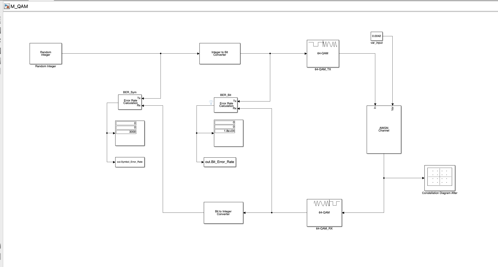
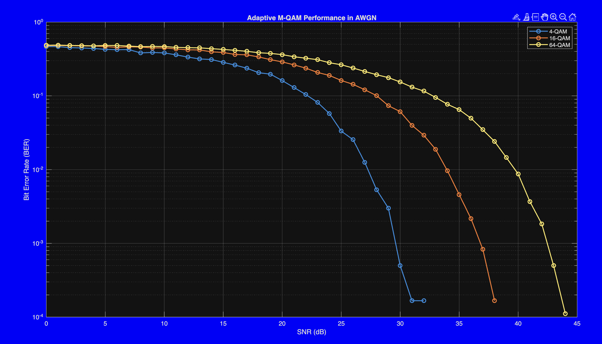

#  M-QAM Performance Analysis in AWGN Channels

##  Project Overview
This project models, simulates, and analyzes an M-Tuple Quadrature Amplitude Modulation (M-QAM) digital communication system using **MATLAB R2025b** and **Simulink**. 

The simulation evaluates the fundamental trade-off between spectral efficiency and Bit Error Rate (BER) across varying Signal-to-Noise Ratios (SNR). By programmatically switching between **4-QAM (QPSK), 16-QAM, and 64-QAM**, it demonstrates how modern telecommunication networks adapt to fluctuating channel conditions to maintain reliable data links.

---

##  System Model

The data pipeline mirrors a standard real-world baseband transceiver. 

* **Transmitter:** Random integer generation, bit-conversion, and Rectangular M-QAM baseband modulation.
* **Channel:** Additive White Gaussian Noise (AWGN), with variance dynamically controlled by a MATLAB control script to simulate SNR sweeps (0 dB to 60 dB).
* **Receiver:** Hard-decision demodulation, integer-conversion, and dual Error Rate Calculation (BER & SER).

---

##  Visualizing Channel Noise ( Signal Constellation )

**[ Watch the Constellation & SNR Sweep Simulation](Constellation_M-QAM.mov)**

* **The SNR Effect:** As the simulation sweeps from low to high SNR, the heavily dispersed signal clouds rapidly condense into tight, distinct clusters around the ideal reference crosses, drastically reducing the probability of decision errors.

---

## BER vs. SNR Waterfall Curves

The core performance analysis is captured in the comparative BER waterfall plots extracted directly from the Simulink workspace.

###  Takeaways:
1.  **4-QAM (QPSK) - Maximum Robustness:** Achieves a near-zero Bit Error Rate at very low SNR. The massive Euclidean distance between the 4 symbols requires extreme noise to cause a bit error, at the cost of the lowest spectral efficiency (2 bits/symbol).
2.  **64-QAM - Maximum Throughput:** Triples the data rate (6 bits/symbol) but requires a vastly superior channel. Packing 64 points into the same average signal power drastically shrinks the distance between symbols, making it highly susceptible to minor noise fluctuations.
3. **Adaptive Modulation (AMC):** In real-world deployments, the system monitors SNR feedback. It downshifts to 4-QAM in poor signal conditions to prevent dropped packets, and upshifts to 64-QAM in high-SNR conditions to maximize throughput.

### NEED FOR ADAPTIVE MODULATION AND CODING (AMC):
Wireless communication channels (like Rayleigh fading environments) experience constant, unpredictable fluctuations in Signal-to-Noise Ratio (SNR) due to multipath propagation and mobility. 

* **The Problem with Fixed Modulation:** A static modulation scheme forces a compromise. If the system is locked into 64-QAM, deep channel fades will cause massive data loss and spike the Bit Error Rate (BER). Conversely, if it is locked into 4-QAM, it sacrifices valuable spectral efficiency when the channel is clear.
* **The AMC Solution:** To solve this, the transmitter continuously monitors SNR feedback from the receiver. It dynamically adapts the modulation order—downshifting to robust schemes (like 4-QAM) during poor signal conditions to prevent dropped packets, and upshifting to dense schemes (like 64-QAM) during high-SNR periods to maximize throughput.

🔗 **Related Implementation:** To see this dynamic switching in action, check out my recent project simulating this exact behavior:
[**Adaptive M-QAM Performance over Rayleigh Fading Channels**](INSERT_YOUR_GITHUB_LINK_HERE)
---

##  How to Run
1.  Clone this repository and open MATLAB (R2025b or later recommended).
2.  keep `M_QAM.slx` and `runSimulation.m`  in same directory.
3.  Execute `runSimulation.m` in Matlab.
